# Rapport de Projet — Pipeline CI/CD Sécurisé (Python/Flask)

**Membres du groupe :** _EL WARDI Abderrazzak_

**Repository GitHub (public) :** https://github.com/aelwardi/project-security  
**Image Docker Hub :** `aelwardi1/project-security:latest`

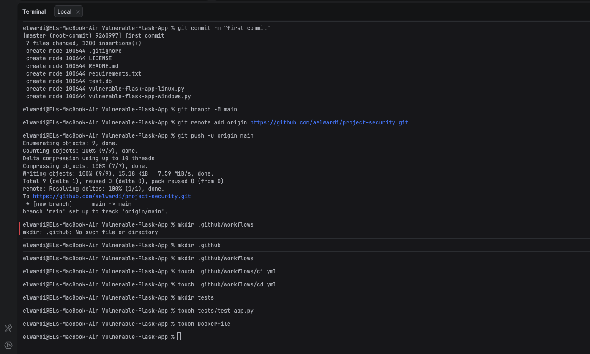

## Sommaire
1. [Objectif du projet](#1-objectif-du-projet)
2. [Prérequis (secrets & environnement)](#2-prérequis-secrets--environnement)
3. [Présentation de l’application](#3-présentation-de-lapplication)
4. [Étape 1 — CI](#4-étape-1--ci-continuous-integration)
5. [Étape 2 — Trivy (SARIF) & remédiation](#5-étape-2--trivy-scan-sarif--remédiation-avantaprès)
6. [Étape 3 — CD](#6-étape-3--cd-continuous-deployment)
7. [Fichiers à fournir](#7-fichiers-à-fournir-en-blocs-de-code)
8. [Checklist livrable](#8-checklist-livrable-conforme-à-lénoncé)
9. [Références & liens](#9-références--liens)

## 1) Objectif du projet
Mettre en place un pipeline CI/CD complet via **GitHub Actions** pour une application Python, incluant :

1. Exécution des tests sur plusieurs versions de Python (3.8, 3.9, 3.10)
2. Scan de vulnérabilités avec **Trivy** + upload SARIF vers GitHub Security
3. Build et push d’une image Docker sur **Docker Hub**

Le projet est basé sur une application Flask volontairement vulnérable (trouvé sur github : https://github.com/videvelopers/Vulnerable-Flask-App) afin de démontrer aussi des mesures défensives (scan et remédiation).

## 2) Prérequis (secrets & environnement)

### 2.1 Docker Hub
Créer un token Docker Hub puis définir les secrets GitHub :

- `DOCKER_USERNAME`
- `DOCKER_PASSWORD` (token)

**Captures à fournir :**
- Secrets GitHub configurés (Settings → Secrets and variables → Actions)
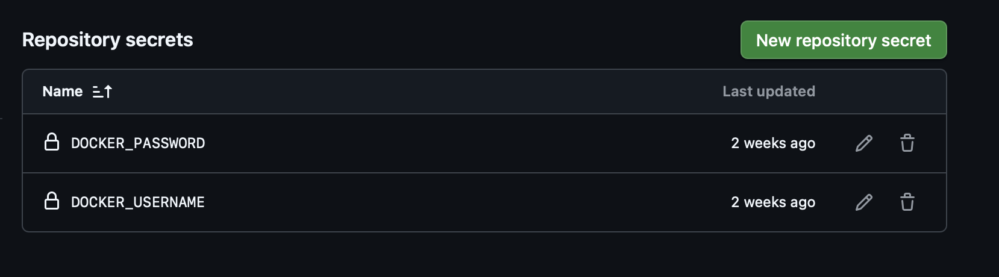

### 2.2 Activation Code Scanning (SARIF)
L’upload SARIF nécessite que **Code Scanning** soit activé dans le dépôt :

Settings → Code security and analysis → **Code scanning**.

**Note :** sur certains dépôts privés, certaines fonctionnalités peuvent être restreintes.

Architecture :
```text
project-security/
├── .github/
│   └── workflows/
│       ├── ci.yml             # Tests + Trivy
│       └── cd.yml             # Docker Build & Push
├── app.py                     # Code de la "Vulnerable Flask App"
├── requirements.txt           # Dépendances Python
├── Dockerfile                 # Image Docker
├── test.db                    # Base SQLite de démonstration
├── tests/
│   └── test_app.py            # Tests Pytest
└── README.md                  # Rapport
```

**Captures à fournir :**
- Code scanning activé dans les settings
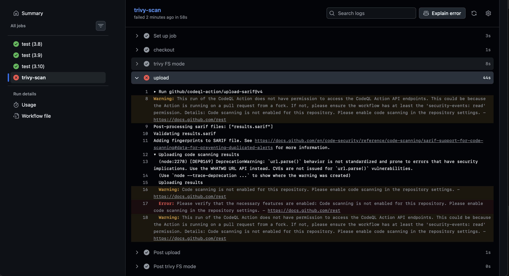 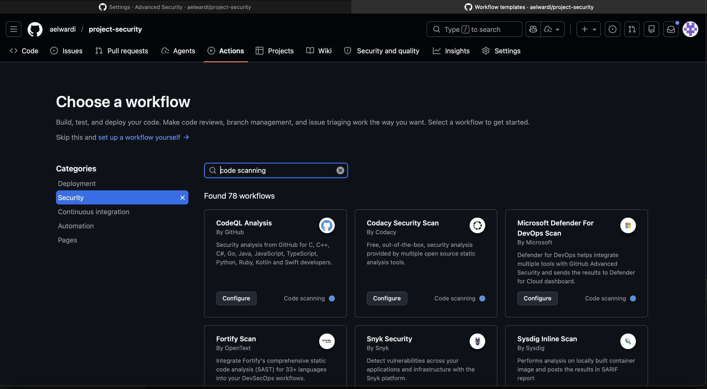

## 3) Présentation de l’application
L’application (`app.py`) expose volontairement plusieurs failles (liste non exhaustive) :

- **SQL Injection (SQLi)** : `/user/<name>`
- **Command Injection** : `/get_users?hostname=...` (usage `shell=True`)
- **SSTI / template injection** : `/hello?name=...` (utilisation d’un template basé sur une entrée utilisateur)
- **LFI / lecture de fichier** : `/read_file?filename=...`

Ces vulnérabilités justifient l’usage d’un pipeline intégrant des contrôles de sécurité et de qualité.

## 4) Étape 1 — CI (Continuous Integration)

### 4.1 Objectif
À chaque push (main/master) et via déclenchement manuel, la CI :

- exécute un lint (`flake8`)
- exécute des tests (`pytest`)
- lance un scan Trivy et charge le rapport dans GitHub Security (SARIF)

**Capture à fournir :**
-  CI complète en vert dans l’onglet Actions (jobs Python 3.8 / 3.9 / 3.10 + trivy-scan)

### 4.2 Incident rencontré (avant/après) — import de l'app et dépendances

**Avant (Erreur CI)**
- `ModuleNotFoundError` lors de l’import de `app.py` dans les tests.
- Causes identifiées :
  1) Pytest ne trouvait pas le module `app` → ajout de `PYTHONPATH=.`
  2) Le runner GitHub ne contenait pas les dépendances applicatives → ajout de `pip install -r requirements.txt`

**Après (Correctif CI)**
- Ajout de :
  - `pip install -r requirements.txt` dans l’étape `dependencies`
  - `PYTHONPATH=. pytest tests/` dans l’étape `pytest`
- Résultat : tests stables et reproductibles en CI.

**Captures à fournir :**
- 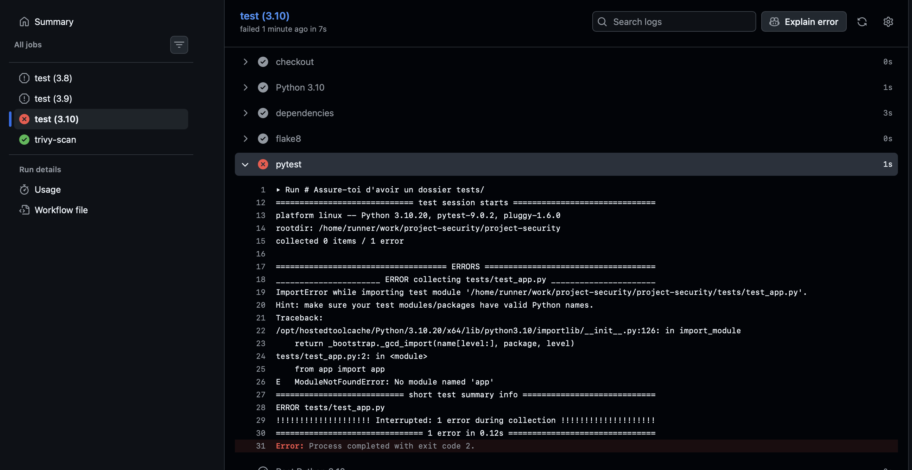 log CI montrant l’erreur (avant)
-  log CI montrant le succès (après)

## 5) Étape 2 — Trivy (scan SARIF) & remédiation (avant/après)

### 5.1 Détection (état “Avant”)
Pour démontrer la remédiation demandée (« implement the security measures related to what Trivy detected »), une première version du `requirements.txt` a utilisé des versions volontairement anciennes.

**Avant (dépendances vulnérables – exemple pédagogique)**
```txt
flask==1.1.1
jinja2==2.10.1
werkzeug==0.15.5
pytest
flake8
```

Trivy et/ou Dependabot ont alors remonté des vulnérabilités (CVE) sur ces dépendances.

**Capture à fournir :**
- Security → Code scanning / Dependabot alerts montrant les vulnérabilités (avant)
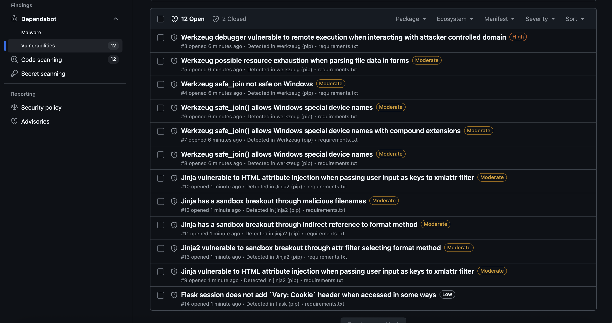

### 5.2 Mesure de sécurité (état “Après”)
**Après (dépendances mises à jour & patchées)**
```txt
flask>=3.0.3
werkzeug>=3.0.3
jinja2>=3.1.4
pytest
flake8
```

**Résultat :** réduction/suppression des alertes sur les dépendances après mise à jour.


### 5.3 Veille technologique — incident supply chain Trivy (mars 2026)
Lors de la mise en place, une alerte de sécurité majeure (mars 2026) a concerné l’action GitHub `aquasecurity/trivy-action` (tag hijacking).  
En conséquence, **la version utilisée a été remplacée par `v0.35.0`** (version explicitement indiquée comme sûre), même si l’énoncé mentionne `0.33.1`.

## 6) Étape 3 — CD (Continuous Deployment)

### 6.1 Objectif
Lorsque le workflow **CI** se termine avec succès, le workflow **CD** :

- se connecte à Docker Hub (`docker/login-action@v3`)
- build l’image avec le `Dockerfile`
- push l’image sur Docker Hub

**Capture à fournir :**
-  CD en vert dans Actions
- 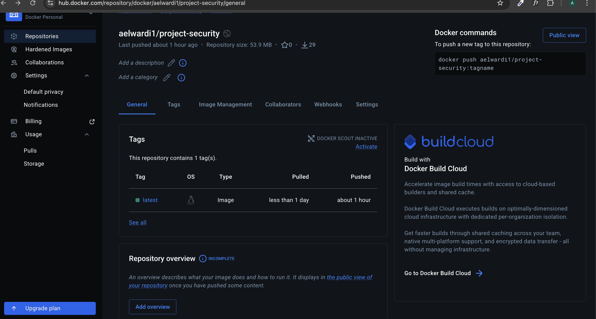
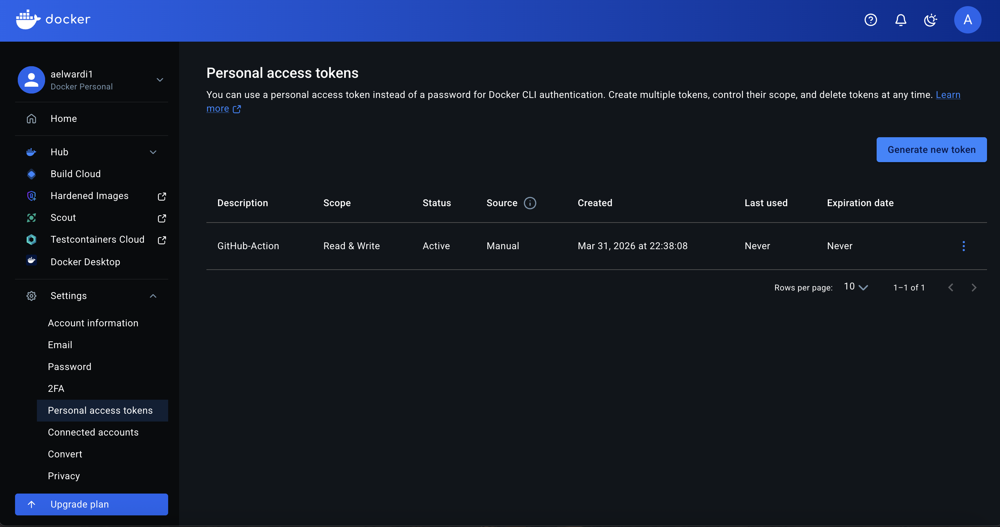 Docker Hub montrant l’image `aelwardi1/project-security:latest`

## 7) Fichiers à fournir (en blocs de code)

### 7.1 `.github/workflows/ci.yml`
```yaml
name: CI

on:
  push:
	branches: ["main", "master"]
  workflow_dispatch:

permissions:
  contents: read
  security-events: write
  actions: read

jobs:
  test:
	runs-on: ubuntu-latest
	strategy:
	  matrix:
		python-version: ["3.8", "3.9", "3.10"]

	steps:
	  - name: checkout
		uses: actions/checkout@v5

	  - name: Python ${{ matrix.python-version }}
		uses: actions/setup-python@v6
		with:
		  python-version: ${{ matrix.python-version }}

	  - name: dependencies
		run: |
		  python -m pip install --upgrade pip
		  pip install -r requirements.txt
		  pip install flake8 pytest

	  - name: flake8
		run: |
		  # Premier run : Arrêt sur erreurs critiques
		  flake8 . --count --select=E9,F63,F7,F82 --show-source --statistics
		  # Deuxième run : Ne pas bloquer (exit 0) pour le reste
		  flake8 . --count --exit-zero --statistics

	  - name: pytest
		run: |
		  # PYTHONPATH=. permet à pytest de trouver le fichier app.py à la racine
		  PYTHONPATH=. pytest tests/

  trivy-scan:
	runs-on: ubuntu-latest
	steps:
	  - name: checkout
		uses: actions/checkout@v5

	  - name: trivy FS mode
		# On utilise v0.35.0 au lieu de 0.33.1 pour éviter le malware de mars 2026
		uses: aquasecurity/trivy-action@v0.35.0
		with:
		  scan-type: 'fs'
		  format: 'sarif'
		  output: 'results.sarif'
		  severity: 'CRITICAL,HIGH'

	  - name: upload
		uses: github/codeql-action/upload-sarif@v4
		with:
		  sarif_file: 'results.sarif'
```

> Remarque : en production, le pinning par SHA est recommandé (immutable). Ici, le tag `v0.35.0` est retenu car explicitement indiqué comme sûre suite à l’incident.

### 7.2 `.github/workflows/cd.yml`
```yaml
name: CD

on:
  workflow_run:
	workflows: ["CI"]
	types:
	  - completed

jobs:
  build:
	runs-on: ubuntu-latest
	if: ${{ github.event.workflow_run.conclusion == 'success' }}
	steps:
	  - name: checkout
		uses: actions/checkout@v5

	  - name: login
		uses: docker/login-action@v3
		with:
		  username: ${{ secrets.DOCKER_USERNAME }}
		  password: ${{ secrets.DOCKER_PASSWORD }}

	  - name: build and push
		id: push
		uses: docker/build-push-action@v6
		with:
		  context: .
		  push: true
		  tags: aelwardi1/project-security:latest
```

### 7.3 `Dockerfile`
```dockerfile
FROM python:3.9-slim
WORKDIR /app
COPY requirements.txt .
RUN pip install --no-cache-dir -r requirements.txt
COPY . .
EXPOSE 5000
CMD ["python", "app.py"]
```

### 7.4 `app.py`
```python
# Voir fichier app.py du dépôt (application vulnérable fournie)
```

## 8) Checklist livrable (conforme à l’énoncé)
- [ ] URL du dépôt GitHub public
- [ ] Screenshot CI pipeline passing (Actions)
- [ ] Screenshot CD pipeline passing (Actions)
- [ ] Screenshot Docker Hub montrant le tag `latest`
- [ ] Copies des fichiers : `ci.yml`, `cd.yml`, `Dockerfile` (et mention de `app.py`)

## 9) Références & liens

### Énoncé / ateliers / docs GitHub
- GitHub Actions — documentation : https://docs.github.com/en/actions
- Workflow syntax for GitHub Actions : https://docs.github.com/en/actions/using-workflows/workflow-syntax-for-github-actions
- Sécurisation des actions tierces (recommandation SHA pinning) : https://docs.github.com/en/actions/security-guides/security-hardening-for-github-actions#using-third-party-actions

### Trivy, SARIF et Code Scanning
- Trivy Action : https://github.com/aquasecurity/trivy-action
- Trivy (scanner) : https://github.com/aquasecurity/trivy
- GitHub Code Scanning : https://docs.github.com/en/code-security/code-scanning
- SARIF support : https://docs.github.com/en/code-security/code-scanning/integrating-with-code-scanning/sarif-support-for-code-scanning
- Upload SARIF (`github/codeql-action/upload-sarif`) : https://github.com/github/codeql-action/tree/main/upload-sarif

### Docker (CI/CD)
- Docker login action : https://github.com/docker/login-action
- Docker build-push action : https://github.com/docker/build-push-action
- Docker Hub Access Tokens (recommandé) : https://docs.docker.com/docker-hub/access-tokens/

### Qualité & tests
- Pytest : https://docs.pytest.org/
- Flake8 : https://flake8.pycqa.org/

## 10) Chronologie des incidents & preuves (captures)

Cette section regroupe les éléments **avant / après** demandés pour démontrer la démarche : détection → correction → validation.

### 10.1 Incident Supply Chain Trivy (mars 2026)

**Contexte** : en mars 2026, une compromission de tags GitHub a affecté `aquasecurity/trivy-action` (tag hijacking), permettant l’exfiltration potentielle de secrets sur runner CI.

- **Avant (risque)** : l’énoncé demandait `aquasecurity/trivy-action@0.33.1` (version dans la plage affectée `< 0.35.0`).
- **Après (mesure)** : utilisation de `aquasecurity/trivy-action@v0.35.0` (version indiquée comme saine).

### 10.2 Activation Code Scanning (SARIF)

- **Avant (erreur)** : `Code scanning is not enabled for this repository` au moment de l’upload SARIF.
- **Après (correction)** : activation de Code Scanning (Settings → Code security and analysis) + permission `security-events: write` dans `ci.yml`.

### 10.3 Alertes Trivy & Dependabot sur dépendances Python

**Avant (détection)** : dépendances volontairement vulnérables pour déclencher des CVE via Trivy/Dependabot.

**Après (remédiation)** : mise à jour vers des versions patchées et re-scan.

### 10.4 Incident CI Pytest — `ModuleNotFoundError: No module named 'app'` / `'flask'`

- **Avant (erreur)** : Pytest échoue lors de la collection des tests (import de `app.py`).
- **Après (correction)** :
  - Installation des dépendances applicatives (`pip install -r requirements.txt`)
  - Ajout de `PYTHONPATH=.` pour garantir la résolution du module `app`.

______________________ ERROR collecting tests/test_app.py ______________________
ImportError while importing test module '/home/runner/work/project-security/project-security/tests/test_app.py'.
Hint: make sure your test modules/packages have valid Python names.
Traceback:
/opt/hostedtoolcache/Python/3.10.20/x64/lib/python3.10/importlib/__init__.py:126: in import_module
return _bootstrap._gcd_import(name[level:], package, level)
tests/test_app.py:2: in <module>
from app import app
E   ModuleNotFoundError: No module named 'app'
=========================== short test summary info ============================
ERROR tests/test_app.py
!!!!!!!!!!!!!!!!!!!! Interrupted: 1 error during collection !!!!!!!!!!!!!!!!!!!!
=============================== 1 error in 0.12s ===============================
Error: Process completed with exit code 2.

Captures

6. Captures avant corrections :
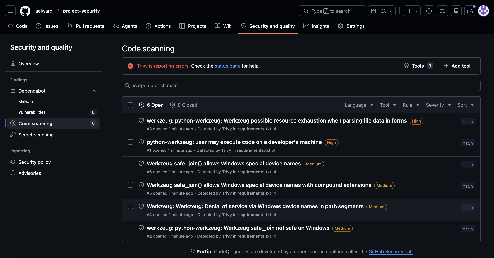
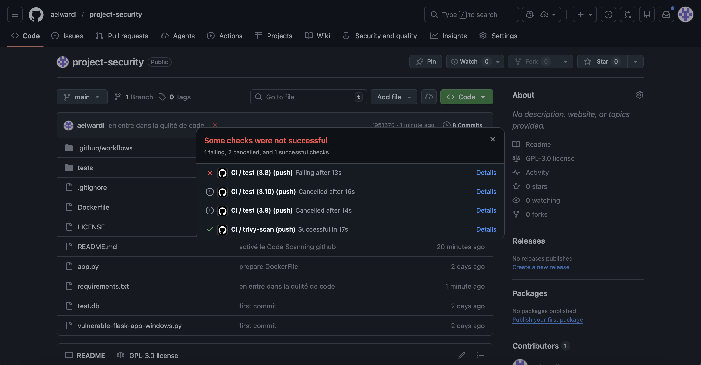
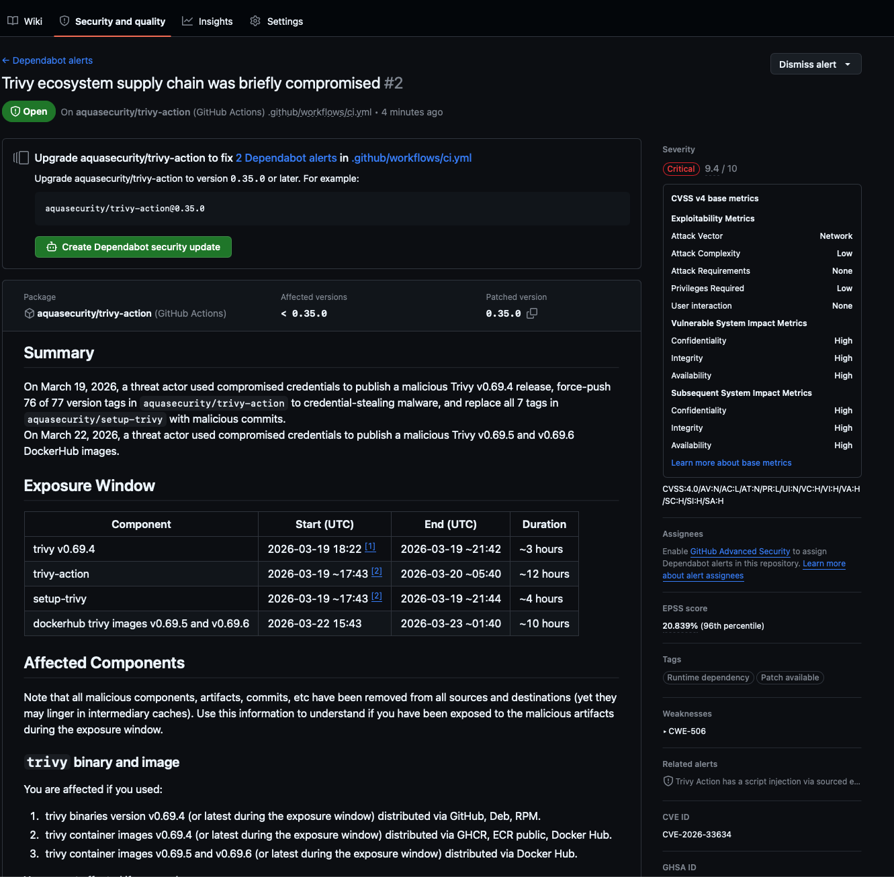
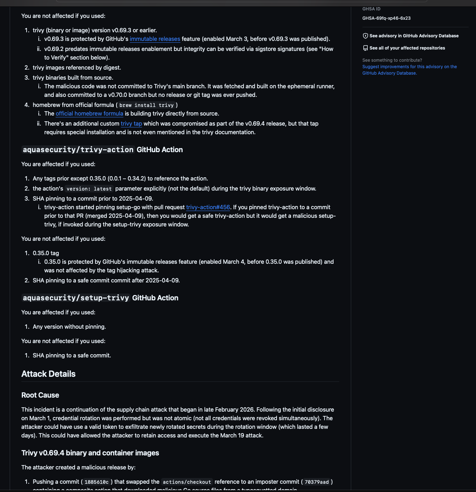
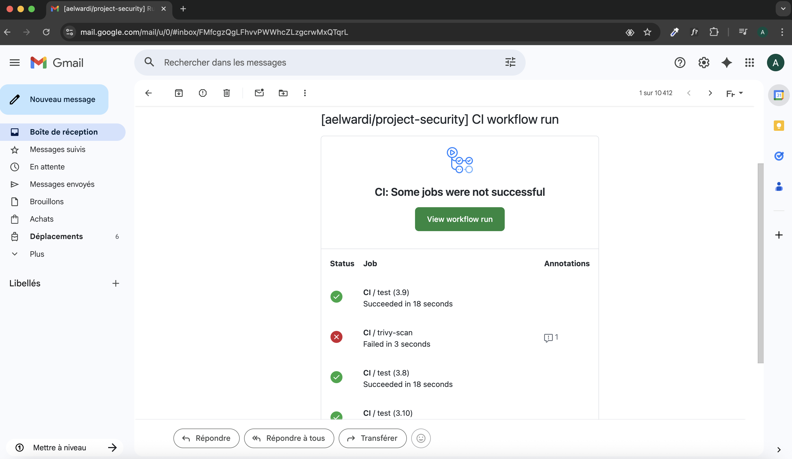
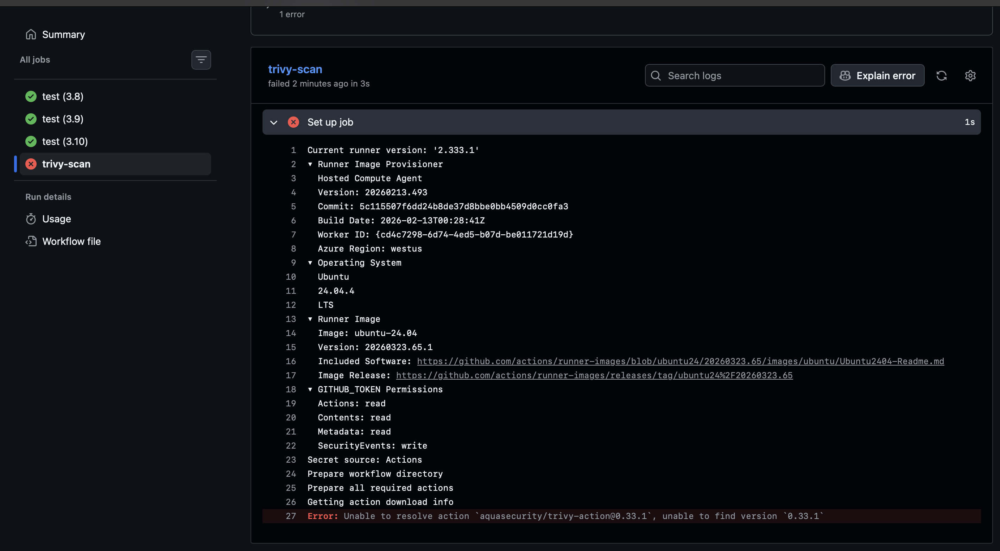

7. Captures tout vert apres corrections :
